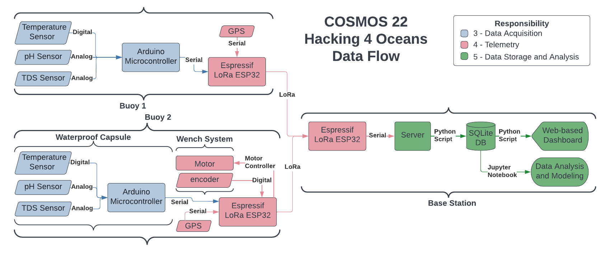
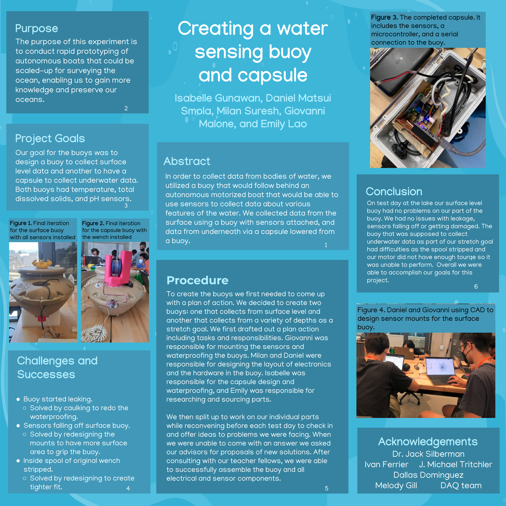
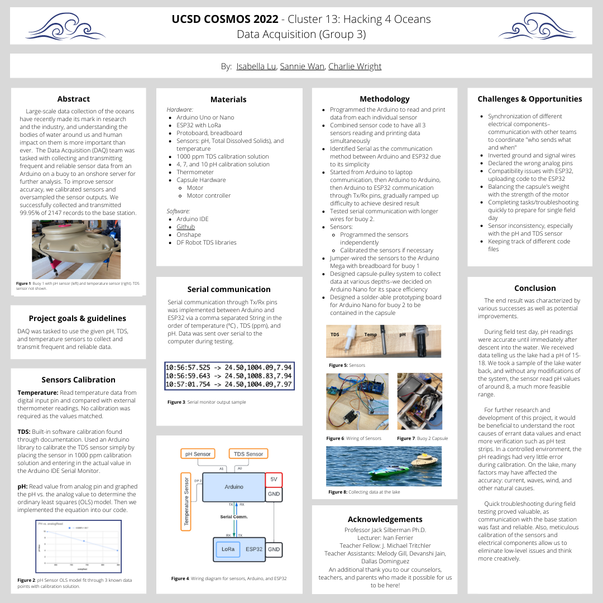
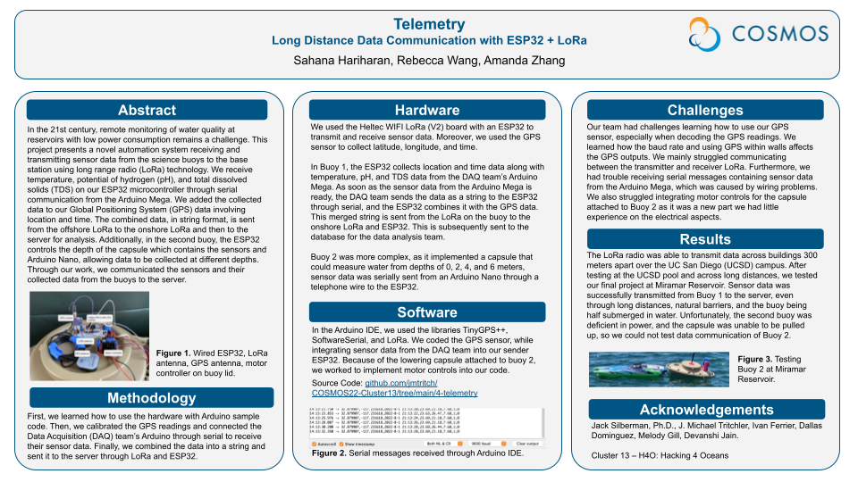
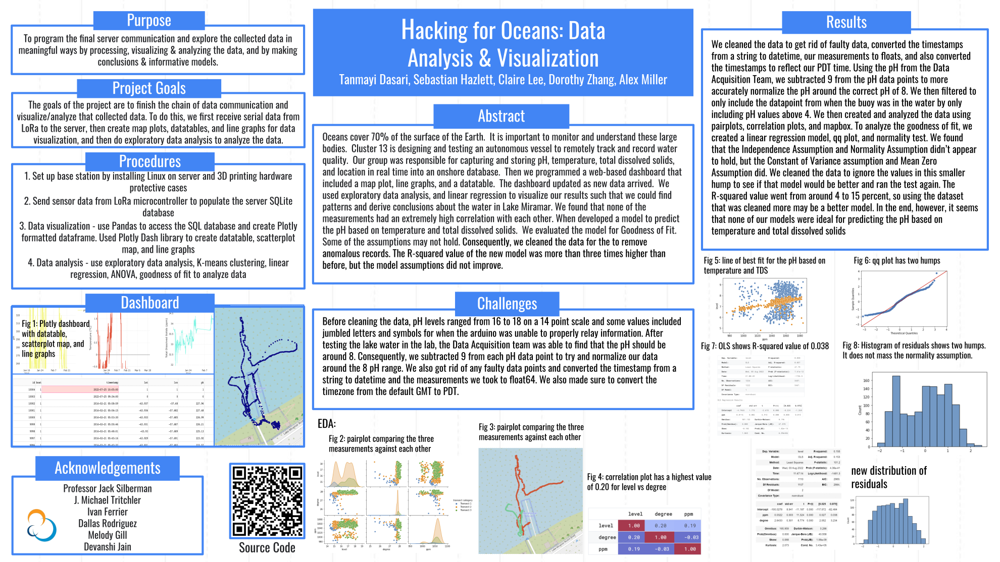

# UCSD COSMOS 2022 Cluster13 - H4O: Hacking for Oceans

This Cluster was inspired by the success of the [Scripps Institute of Oceanography and UCSD’s Hacking for the Oceans](http://h4oceans.ucsd.edu/) graduate and undergraduate level class.

During this inaugural year students applied engineering theory and industry-recognized best practices in the development of affordable instrumentation and robotic devices by innovating and adopting new technologies to monitor, generate and analyze data for our oceans at scale. Students worked in teams to:

* Develop a surface unmanned autonomous vehicle (UAV) including testing and documentation.
* Select and integrate low power and affordable instrumentation for the UAV using microcontrollers.
* Collect, visualize, model, and analyize water quality data, including temperature, total dissovled solids, and pH levels.

Students explored and applied principles of autonomous robots, microcontrollers, Python, and data visualization and analysis tools.

Working in 5 teams, students had to achieve their team objectives while ensuring that their work integrated seemlessly with the work of the other teams.  This required teams to identify goals, project timelines, and protocols for communication between devices and team inputs and outputs.

## Teams

1. Boat
   * Worked on converting a Traxxas high-speed RC Boat into an autonomous boat: integrated a flight controller, GPS, and a radio for communicating with an autopilot software on a base station computer, designed and printed enclosures for protecting the electronics from water damage, and modified the steering system to be more agile.
2. Buoy
   * Designed and constructed the buoy-based instrumentation for data collection. Two buoys were constructed.  The first buoy was designed to collect sea-surface data with the instrumentation submerged off the sides.  The second buoy was designed to lower and raise sumbersible instrumentation to collect vertical profiles of water quality data.
3. Data Acquisition
   * Ensured accurate data readings by calibrating and oversampling the sensor data.  Programmed the microcontroller to send the sensor data to the telemetry microcontroller.  Multiple microcontrollers were necessary becasuse the instrumentation in the second buoy was packeged in a submerssible payload. Worked collaboratively with the telemetry team to develop the communication protocol (serial) and data format for communication.
4. Telemetry
   * Responsible for data communication between buoys and base station.  Programmed a buoy-based microcontroller to receive sensor data via Serial connection, combine the data with a timestamp and GPS coordinates, and transmit that data via long range radio (LoRa) to the base-station.  The base-station LoRa microcontroller recieves the data and transmits it to a linux-based server via Serial connection.
5. Data Storage and Analysis
   * Configured the server to receive the sensor data from the telemetry team's base-station microcontroller via serial connection.  Designed a normalized database in SQLite to store the data.  Developed a python script to receive the data via serial connection and populate the database.  Developed a Python-based databoard to visualize the data as it is received.  Utilized Python and Jupyter notebooks to visualize, model, and analyze the data.

## Data Flow

## Team Posters

